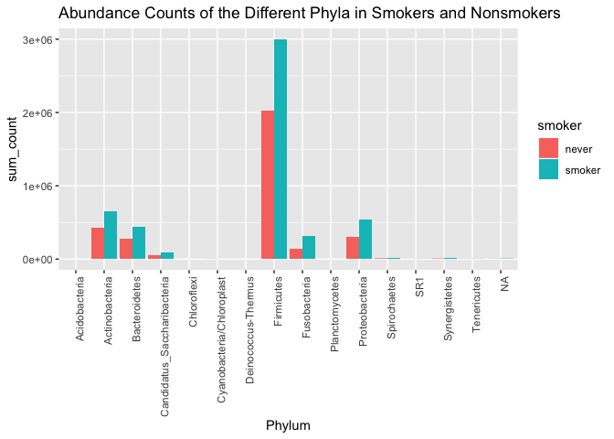
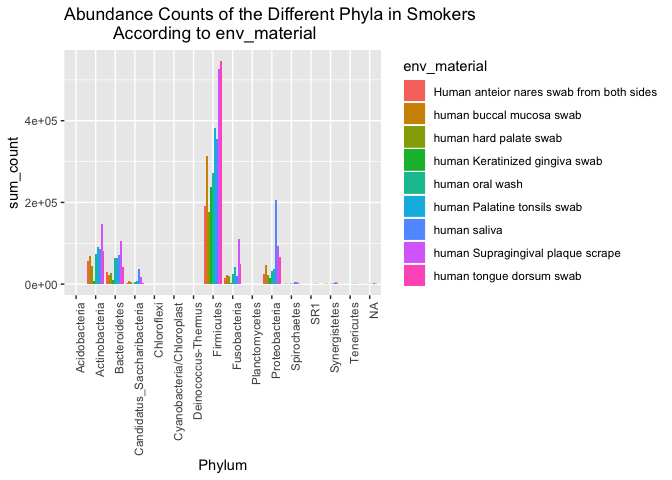
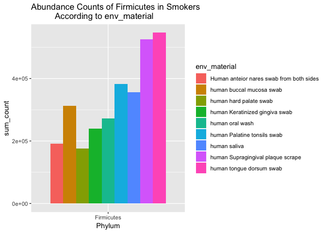
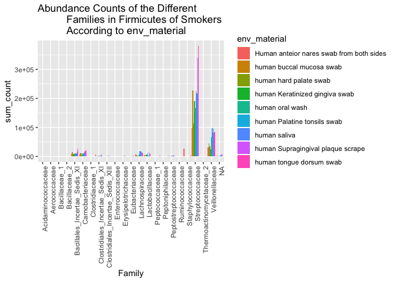
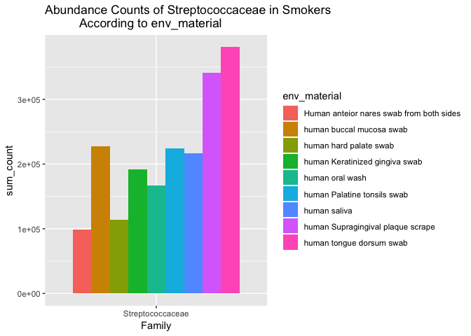
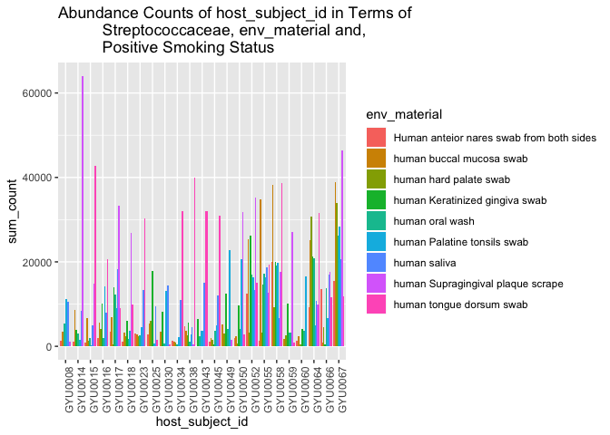

The Difference in Bacterial Communities in Smokers Vs. Nonsmokers Seen Through the Variation in Abundance of *Streptococcaceae* in Plaque Scrape Samples Among Separate Smoking Individuals
================
Kailie Dela Cruz
December 5, 2018

Introduction
============

One of the national health objectives for the United States has been focusing on trying to limit the amount of cigarette smoking among the adult population (Disease Control *et al.*, 2002). In the year of 2000, approximately 23.3% of adults in the United States were current smokers, which was in relation to a total population of 282.2 million people. In this 23.3% of adults who smoked, 70% of them were interested in quitting and 40% of them actually attempted to quit. There are many reasons as to why cigarette smoking may be so prevalent in our world and why it may be so difficult to quit using these small sticks of nicotine. In our world today, many people search for success in money, their businesses, etc. (McGowan, 1995). As cigarettes grew in popularity over the years, many people took advantage of this and based their businesses on selling them. Through this, they were able to make a lot of money, and continued to do so through putting up advertisements all around the country to promote smoking. Even though there are many negative and detrimental effects that are associated with smoking, these advertisements would publicize cigarettes as "cool" or necessary to life (McGuinness and Cowling, 1975). While there are these types of advertisements about cigarettes all around us and businesses that are shaped around selling them, smoking can also be seen as popular due to things like peer pressure as well. In societies today, it can be in middle school where you are peer pressured to do things like smoke cigarettes, smoke marijuana, and have sexual intercourse (Simons-Morton *et al.*, 2001). Transitioning into high school, these types of peer pressures are amplified and so it makes sense that many adults are founding smoking cigarettes for majority of their lives after that (Brown, 1982).

In being surrounded by businesses that strongly market smoking and peers that pressure you into doing it, there are many effects that are associated with this well-known action. Majority of the time, people focus on the detrimental and negative effects that correspond to cigarettes, but it may be possible that people have a hard time quitting smoking because of its positive effects as well (Hajek, 1991). In a study done by Pomerleau et al., they looked at the antinociceptive and anxiolytic consequences of smoking nicotine cigarettes. In inducing pain in the test subjects, they all showed pain and anxiety reduction after smoking a cigarette (Pomerleau *et al.*, 1984). Through this, it can be seen that smoking can produce psychological changes that positively impact regular smokers. Another positive consequence associated with smoking that may make it hard to quit, is the fact that they are made so convenient today. Even though there are many rules and regulations that say you are not able to smoke cigarettes on planes, smoke them close to buildings, etc. there is a new form of smoking that was introduced to our country not too long ago, ecigarettes.

Ecigarettes are also known as electronic cigarettes or "vapes" and contribute to a $1.7 billion industry in the 21st century (Chapman and Wu, 2014). Some examples of ecigarettes include things like juuls, mods, suorins, etc. Though little is known about the users of electronic cigarettes, a survey of 81 ecigarette users was done to provide us with some information about the use of them (Etter, 2010). Through this survey, it was seen that ecigarettes are mainly used to quit smoking, and may actually be helpful with this because of its nicotine composition. With these ecigarettes, they are also becoming more common in comparison to actual cigarettes because they are very cost-efficient and able to be smoked in more areas (Volesky *et al.*, 2016). This makes it easier for the younger population to obtain them as well, which is just another influence that may lead to the high percentage of adults that smoke cigarettes.

Even with all of these positive effects such as pain and axiety reduction and the convenience and cost-efficiency of ecigarettes, smoking in general is known for its detrimental effects more than anything. Cigarettes are commonly linked to many life-threatening diseases, such as diabetes, lung cancer, etc. (Health *et al.*, 2004) In a high number of clinical and experimental studies and surveys done, it was strongly supported that there were significant associations between tobacco use and the development of diabetes (Eliasson, 2003). Specifically, the increased risk for diabetes in smoking men and women is around 50%. Through an increased risk for diabetes through cigarettes also came increased risks for things like diabetic nephropathy, retinopathy, and neuropathy. It was said that in working to reduce the effects of type 2 diabetes, the reduction of cigarette smoking would definitely help this. Not smoking at all though, would decrease the risk of diabetes in general and therefore the other diseases that relate to it.

One of the most commonly looked at diseases that is caused by cigarettes is lung cancer. Tobacco was not initially thought of as a cause of lung tumors (Proctor, 2012). However, today, there are many studies done that relate the action of smoking to the prevalence of lung cancer in our country. One of these studies concluded that cigarette smoking acts as another carcinogenic factor in the creation of carcinoma of the lung and its increasing development in proportion to the amount that is smoked (Watson and Conte, 1955). With this, it is seen that the relative prevalence of lung cancer in 100,000 male smokers is five times as great as in a non-smoker group. Because cigarette smoking has very strong ties to life-threatening diseases such as cancer, it is important to understand its specific effects to the parts of our bodies that interact with cigarettes on a molecular and microbiome level.

In a study done by Yu et al., the researchers took a closer look at how cigarette smoking alters the oral and nasal microbiota. In looking at data of 23 current smokers and 20 never smokers that was sequenced using an Illumina Miseq instrument(Quail *et al.*, 2012), a next generation sequencing platform, they used things like the Wilcoxin rank-sum test (O’Brien and Fleming, 1987) and Spearman correlation (Myers and Sirois, 2004) to understand the difference between both groups (Yu *et al.*, 2017). Through their research, they discovered that there was a potential effect of cigarette smoking on the buccal mucosa microbiota, or the lining of the mouth (Shojaei and others, 1998). Along with this, they also came to the belief that the heterogeneity of the oral microbiome may in fact, contribute, to the stability of the oral microbiota in most areas when interacting with cigarettes.

In analyzing the data from the Yu et al. study, I had two main questions. The first question was if there would be a noticeable difference in bacterial communities between participants who were considered current smokers and participants who were considered never smokers. If there was this difference, the second question focuses on the general variation of abundance of a focal family between smoking individuals and the different environmental samples that the researchers in the Yu et al. study looked at. In the Yu et al. study there were 328 total samples looked at. Running the data from each of these samples through the DADA2 pipeline, I analyzed the reads that were cleaned by filtering, trimming, etc. Taking a look at the bacterial communities, specifically the phyla in smoking and nonsmoking individuals, would provide me with basic information about how the bacterial communities generally differ between the two. Looking at the samples in relation to the smokers and nonsmokers, for the first question, I hypothesized that the bacterial communities would be different in terms of their taxonomy. For the second question, I hypothesized that individual smokers would have similar abundances of the focal family in terms of the different environmental sample materials, while separate smokers would have larger variations in abundances of the focal family between each other. Seeing a major difference between the bacterial phyla of smokers and nonsmokers could ultimately provide us with information that significantly relates to everyone. In further detail, getting a better idea about the difference in bacterial communities in smokers vs. nonsmokers could provide a general idea about how bacteria may affect their bodies in different ways. Relating this to the real world, this bacterial difference may be what increases the risk of life-threatening diseases when we come into contact with nicotine and gaining a better idea of this can help us to stop these life risks.

Methods
=======

Study design
------------

Working at Eastman Institute of Oral Health, University of Rochester, Yu et al. recruited 23 current smokers with the following specifics: median duration, 15 years; median intensity, 15 cigarettes per day) and 20 nonsmokers who have smoked less than 100 cigarettes in their lifetime. Yu et al. excluded subjects who were using antibiotics at the time, had a professional dental cleaning within the last three months, or diagnosed with periodontal disease, which is a serious gum infection, or cancer. To determine if each participant needed to be excluded, the participants were screened by periodontal screening and recording (PSR) index at the time of recruitment. After all subjects were recruited, they signed a consent form and filled out questionnaires in relation to the study (Yu *et al.*, 2017).

Sample origin and sequencing
----------------------------

### Biospecimen Collection

Yu et al. obtained nine samples, including supra and subgingiva plaque, saliva, swabs from five soft tissue areas, and one nasal swab from both nostrils, from each participant. They used the procedure of the Human Microbiome Project to collect the samples.

### 16S rRNA Gene Sequence Analysis

After Yu et al. extracted the DNA from each sample, they amplified the V3-V4 regions of the 16S rRNA gene and sequenced it on an Illumina MiSeq instrument using the 300 paired-end protocol. They obtained this instrument from the Institute of Genome Sciences, Genomic Resource Center, University of Maryland School of Medicine and submitted the sequence data to NCBI BioProject.

Yu et al. processed the sequence reads in order to remove low quality and short reads. The remaining reads were bunched into Operational Taxonomy Units (OTUs) at 97% identity, and OTUs with only one read were excluded. They then estimated alpha diversity as the number of OTUs, Shannon's Index, and phylogenetic diversity through averaging &gt;20 tables (1000 reads/sample). After this, they measured taxonomic beta diversity as unweighted and weighted UniFrac distance based on the OTU table. In order to rule out batch effects, or technical sources of differences that have been added to samples during handling, they selected 19 random samples in order to example the difference within and between each batch.

### Statistical Analysis

Yu et al. used the Wilcoxon rank-sum test to examine gastric microbiota alpha diversity and taxa-relative abundance differences between each group. They then used the Spearman correlation to examine the relationship between continuous variables. Yu et al. used Bonferroni correction to adjust for tests of multiple taxa. They also used Permutational multivariate analysis of variance in order to look at the association between unweighted and weighted UniFrac distance and smoking status and other demographic variables. They considered P values of less than 0.05 to be significant after the adjustment for multiple tests.

Computational
-------------

### FastQ Dump

Using the Yu et al. study, I downloaded the raw fastq files from NCBI with the accession number PRJNA316469 using fastq dump in a bash script. The fastq-dump function is a part of the sratoolkit that was initially downloaded. This SRA Toolkit is used to convert .sra files into other formats (Metzker, 2010). For our purposes, this was the fastq format.

### DADA2

Given the data set from the Yu et al. study, I extracted the sample and file names following the DADA2 tutorial (Callahan *et al.*, 2016) in a separate R script. The first step in doing this was to set the base path for our input data files. This means that we provide a path variable so that it points to the input data files on my machine. After defining a path variable, I sorted the samples to ensure that they were in order. With a sorted sample set, I then extracted the sample names, making the assumption that the files have the format of “SAMPLENAME.fastq.” Following this, I specified the full path needed to take to reach each of the filenames\_forward\_reads. After extracting the samples, sorting them, ensuring the format of the files and defining a path for them, I inspected the read quality profiles by plotting the quality profiles of all twenty samples. I then trimmed the data from the filtered files discarding any sequences with Ns, allowing up to 3 expected errors, and cutting off the reads if quality gets as low as 2. I also used the truncLen function in trimming my data to cut off all reads at exactly 200 basepairs. This was done because our data looks at paired end reads, which refers to the two ends of the same DNA molecule. Using the truncLen function at 200 base pairs cut the reads so that only one end would be looked at, where the quality of the reads were still acceptable. To compare the read counts before and after trimming, I created a markdown table. The table showed that the number of read ins were very similar to the number of read outs in the fastq files. Next, continuing with the DADA2 pipeline, I learned the error rates of the data. Every set of data that deals with amplicons has a different set of error rates. This algorithm learns the error model of the dataset by interchanging the estimation of the error rates with the sample structure until they come together as one result. To visualize the errors, I generated plots. This provided the opportunity to check to see if error models match the data. After visualizing the learned error rates, I dereplicated the sequences or got rid of any duplicated sequences. In further detail, dereplication combines the duplicate sequences into one individual and unique sequence with the relevant abundance that is equal to the number of reads with that sequence. This DADA2 algorithm provides a summary of the quality information that is corresponding to each unique sequence. The overall quality profile of the unique sequences is based on the average of the positional qualities from the dereplicated reads. For this study, I named the dereplicated sequences by the appropriate sample names. At this point, I ran dada to obtain multiple diagnostics about the quality of each denoised sequence variant, the number of reads in the number of unique sequences in each of the samples, etc. To visualize the information obtained from running dada, I generated a sequence table and histogram. The tables rows read “samples” and its columns read “sequence variants.” The histogram which displayed the distribution of trimmed and denoised sequences, studied the sequence length in bp in relation to the frequency. Next, I checked for and removed any chimeras found in the data. Chimeras can be checked for by identifying them through the possibility of left and right segments to be constructed exactly from two more abundant “parent” sequences. Using the information gathered so far, I built a table showing how many sequences remain at each step of the pipeline. The columns of the table read “Input,” “Filtered,” “Denoised,” “Sequence Table,” and “Non-chimeric.” Following this, I assigned taxonomy to each sequence variant based on a supplied training set made up of unknown sequences. I exported the cleaned, trimmed, filtered, and denoised sequence variants in order to build a phylogeny to allow for the visualization of the taxonomy. I extracted the sequences to fasta because this is the format that is needed to build a phylogeny.

### Phyloseq

To begin building a phylogeny, I read in the metadata and the phylogeny. I then constructed a phyloseq object with all of the appropriate data, such as phylogeny from sequence variants, taxonomy for each sequence variant and metadata for each sample. In general, a phyloseq tool can be used to import, analyze, and graphically display phylogenetic sequencing data. It is helpful in reproducible interactive analysis and graphics of microbiome census data (McMurdie and Holmes, 2013). However, for this study, I continued by melting the phyloseq object, which puts all of the data for every sample in one file. I then saved both the phyloseq\_obj and melted\_obj with the .Rdata format. In doing this, these files were made compressed and able to be quickly loaded. These saved .Rdata files were loaded on the .Rmd file and used for analysis.

Using the data from these files, I looked at the difference in bacterial communities, specifically the difference in phyla between participants with different smoking statuses. I also analyzed the variation of abundances of the focal family between the smoking individuals, in terms of env\_material. In doing so, I needed the data that related to the taxonomy of all of the env\_material samples as well as the abundances of sequences of the important taxonomy that relate to the samples.

Results
=======

Findings from Methods
---------------------

I looked at 23 current smokers and 20 participants who were considered to be non-smokers in correspondence to environmental material including plaque scrapes, saliva collections, five soft oral tissue sites, and from both nostrils. The data collected from these samples were sequenced using an Illumina Miseq instrument, where the V3-V4 regions of the 16S rRNA gene were amplified. This data was then run through the DADA2 pipeline. In analyzing the quality of each of the reads through plots, I observed that most reads tend to display a drop off at around 200 base pairs. In analyzing the number of "Reads In", before trimming, and "Reads out," after trimming, of each individual file, there was no file that showed a significant difference. In then visualizing the error rates and checking to see if the error models match the data, the black lines generally match up to the black points in the plots and decrease from left to right. There are occasional outlying points where they lie at a point with zero error frequency. This may be due to the idea that these points were expected to show extremely accurate results. After looking at the error rates, a histogram of final sequence variant lengths was looked at. The histogram revealed to be one single value with sequence length of 200 base pairs for each read. This is due to the fact that each read was cut at exactly 200 base pairs, and so there is no sequence length variation. Towards the end of the DADA2 pipeline, chimeras were removed. Through this, 409 bimeras were identified in the 5919 input sequences, which were then analyzed.

Figures
-------

**Figure 1**: Abundance Counts of the Different Phyla in Smokers and Nonsmokers. The Firmicutes phylum had the largest abundance counts for both smokers and nonsmokers in comparison to the other phyla. Firmicutes also reveals the largest variation in abundance counts between smokers and nonsmokers.

**Figure 2**: Abundance Counts of the Different Phyla in Smokers According to env\_material. Fusobacteria and Proteobacteria phyla reveal variation in abundance counts of the different environmental sample materials. However, Firmicutes shows the greatest abundance values for all environmental sample materials, with the tongue swab and plaque scrape samples having the largest values of the 9 materials.

**Figure 3**: Abundance Counts of Firmicutes in Smokers According to env\_material. The tongue swab and plaque scrape samples in Firmicutes had the largest and somewhat similar abundance counts. The other seven samples revealed variation in abundance counts that were not as significant.

**Figure 4**: Abundance Counts of the Different Families in Firmicutes of Smokers According to env\_material. *Veilonellaceae* revealed more significant variation in abundance counts of the different environmental sample materials in comparison to the other families. However, *Streptococcaceae* had the most outstanding variation in abundance counts of the env\_materials. The tongue swab and plaque scrape samples had the largest abundance values, where the other 7 samples in correspondence to this family did not vary as much.

**Figure 5**: Abundance Counts of *Streptococcaceae* in Smokers According to env\_material. This looks closer at the variation in abundance values of the focal family. The abundance values of the tongue swab and plaque scrape samples in relation to *Streptococcaceae* were the largest. The abundance counts of the other 7 sample materials did not show much significant variation and had lower values than the tongue swab and plaque scrape samples in general.

**Figure 6**: Abundance Counts of host\_subject\_id in Terms of *Streptococcaceae*, env\_material, and Positive Smoking Status. The abundance counts of *Streptococcaceae* in relation to the tongue swab samples did not show much variation between each individual. However, there was variation in the abundance counts of *Streptococcaceae* in correspondence to the plaque scrape samples. The variation in abundance counts of the other 7 sample materials were not as significant.

Figure Descriptions
-------------------

### Abundance Counts of the Different Phyla in Smokers and Nonsmokers

In looking at the overall data collected from the Yu et al. study, I first analyzed the abundance counts of the different phyla of the subject's participants, in terms of smoking status \[Figure 1\]. Within both current smokers and nonsmokers, Actinobacteria, Bacteriodetes, Candidatus\_Saccharibacteria, Firmicutes, Fusobacteria, Proteobacteria, Spirochaetes, and Synergistetes were the phyla that were observed. The phyla including Actinobacteria, Bacteriodetes, Candidatus\_Saccharibacteria, Fusobacteria, Proteobacteria, Spirochaetes, and Synergistetes had relatively low abundance counts ranging from 0e+00-.75e+06 and relatively similar abundance counts between smokers and nonsmokers. Firmicutes on the other hand, had a significant abundance count difference between smokers and nonsmokers, and much larger abundance counts in general in comparison to the other phyla. Specifically, the abundance values of this phylum were ~2e+06 for nonsmokers and ~3e+06 for current smokers.

### Abundance Counts of the Different Phyla in Smokers According to env\_material

In seeing a significant difference of the abundance counts of Firmicutes in smokers vs. nonsmokers, I wanted to look further into detail about the different trends of phyla seen in smokers specifically \[Figure 2\]. I decided to look at smokers rather than nonsmokers due to the fact that cigarette smoking is what is expected to cause changes to the oral and nasal microbiota.

In looking at the comparison of abundance counts of the different phyla of smoking individuals in terms of the different env\_materials, Actinobacteria, Bacteriodetes, Candidatus\_Saccharibacteria, Firmicutes, Fusobacteria, Proteobacteria, Spriochaetes, and Syngeristetes were observed. These are also the same phyla that were observed previously \[Figure 1\]. Similar to what was observed previously as well, all of the phyla except for Firmicutes had relatively similar ranges for their abundance counts, ranging from 0e+00-~2e+05. The Fusobacteria and Proteobacteria phyla in particular though, showed somewhat significant differences of the abundance counts in relation to the different env\_materials. For Fusobacteria, the human Supragingival plaque scrape sample had an abundance count of almost twice the amount of the abundance values of the other env\_materials. For Proteobacteria, a similar trend was seen, where the human saliva env\_material showed a higher abundance count in comparison to the other samples. With these important trends though, Firmicutes continued to have the most outstanding results. Specifically, among the 9 different samples taken, the abundance values ranged from 1.8e+05-5.5e+05. Within this phylum, there were also great variations of the abundance counts within each env\_material, where the human tongue dorsum swab and human Supragingival plaque scrape had the largest values.

### Abundance Counts of Firmicutes in Smokers According to env\_material

With the significant variation in abundance counts of the Firmictures phylum in terms of a positive smoking status and the different env\_materials, I wanted to look at the specific variations \[Figure 3\]. Analyzing this data, the abundance counts for the human tongue dorsum swab and the human Supragingival plaque scrape were the largest among the others but also very similar to each other. The plaque scrape had an abundance count of ~5.1e+05, while the tongue swab had an abundance count of ~5.25e+05. The abundance values of the other 7 environmental samples were almost half of what was seen for the tongue swab and plaque scrape samples, where they ranged from 1.75e+05-3.75e+05.

### Abundance Counts of the Different Families in Firmicutes of Smokers According to env\_material

In seeing a significant variation in the abundance counts of Firmicutes according to env\_material and positive smoking status, I decided to then look at the abundance counts of the different families in relation to Firmicutes, according to env\_material and positive smoking status \[Figure 4\]. Through this, I observed the families of *Bacillales\_Incertae\_Sedis\_XI*, *Carnobacteriaceae*, *Clostridiales\_Incertae\_Sedis\_XI*, *Lachnospiraceae*, *Lactobacillaceae*, *Peptoniphilaceae*, *Peptostreptococcaceae*, *Staphylococcaceae*, *Streptococcaceae*, *Veillonellaceae*, and NA. All families except for *Veilloncellaceae* and *Streptococcaceae* had very low abundance counts, near 0e+00, for all environmental sample materials. *Veilloncellaceae*, on the other hand, had abundance counts ranging from .5e+05-~1e+05, where the plaque scrape, tongue swab, saliva collection, and tonsils swab, had higher abundance values in comparison to the other samples. Though this family revealed more outstanding results in comparison to the others, *Streptococcaceae* had even more notable results. The abundance values for this family, in terms of the 9 samples, ranged from 1e+05-3.75e+05. The abundance counts in relation to the tongue swab samples and plaque scrape samples were much larger than the counts of the other environmental sample materials.

### Abundance Counts of *Streptococcaceae* in Smokers According to env\_material

With the significant variation in abundance counts of the *Streptococcaceae* family in terms of a positive smoking status and the different env\_materials, I wanted to look at these results in more detail \[Figure 5\]. In looking at this data, it is similar to what was seen within the Firmicutes phylum according to positive smoking status and env\_material \[Figure 3\]. Specifically, the tongue swab and plaque scrape samples had the largest abundance counts that were relatively similar to each other. The abundance count for the tongue swab sample was ~3.75e+05, while the count for the plaque scrape sample was ~3.4e+05. The abundance values for the other 7 sample sites were much lower than what was seen for the tongue swab and plaque scrape samples. Particularly, these values ranged from 1e+05-2.25e+05.

### Abundance Counts of host\_subject id in Terms of *Streptococcaceae*, env\_material, and Positive Smoking Status

As the tongue swab and plaque scrape samples of smoking individuals had the most significant abundance values of *Streptococcaceae*, I wanted to look further into this and see I was able to link these values to specific individuals. In order to do this, I looked at the abundance counts of host\_subject\_id in terms of *Streptococcaceae*, env\_materials, and positive smoking status \[Figure 6\]. Looking at the tongue swab and plaque scrape samples in particular, there was not much variation in the abundance counts among each individual for the tongue swab samples. However, in looking at the plaque scrape samples, individual CYU0014 had a much higher abundance count for *Streptococcaceae* with a value of ~62,500 in comparison to the other individuals who had abundance values of almost half of this. The abundance counts of the other env\_materials revealed variation, but not as significant as the tongue swab and plaque scrape samples.

Discussion
==========

In this study, we focused on the analysis of the data in terms of the differences between smokers and nonsmokers. The people who were considered current smokers were looked at in comparison to those who were considered to be never smokers. In terms of the analysis of the Yu et al. study, my first primary question asked if there would be a difference between the bacterial communities' taxonomy of the smokers and nonsmokers. My second question asked about the variation of abundance of the focal family, *Streptococcaceae*, in this case, between the smokers and the different environmental sample materials. For my first question, I hypothesized that the data in terms of the smokers and nonsmokers would reveal generally different information in terms of their taxonomy. With the second question, I hypothesized that variation in separate smoking individuals would have large variations in abundances of *Streptococcaceae* between each other in terms of the environmental materials, while individual smokers would have similar abundances of this focal family in terms of the sample materials.

Figure Analysis
---------------

I first took a closer look at the abundances of the different phyla in the smokers' and nonsmokers' data. In observing Actinobacteria, Bacteriodetes, Candidatus\_Saccharibacteria, Firmicutes, Fusobacteria, Proteobacteria, Spirochaetes, and Synergistetes, I was led to the idea that these phyla would be observed when looking at only smokers or only nonsmokers as well \[Figure 1\]. As the Firmicutes phylum showed a large difference in abundance when looking at smokers in comparison to nonsmokers, I was also led to the fact that there *is* a difference between cigarette smokers and never smokers, and can be connected to this specific perspective on their taxonomy data. With this information, I then looked more closely at a comparison of the abundances of the different phyla of smokers according to environmental materials in order to see if I could understand why there would be such difference between the two groups. These results revealed the fact that the Fusobacteria and Proteobacteria phyla had variation in abundance counts in terms of the different environmental sample materials. However, Firmicutes showed the greatest abundance values for all environmental sample materials and the most variation in abundance in comparison to the other phyla, with the tongue swab and plaque scrape samples having both similar values and the largest values of the 9 materials \[Figure 2\]. This information further backed up the idea that I had about seeing similar phyla to ones' that were seen previously \[Figure 1\], when looking at smokers individually. The information gathered here \[Figure 2\], also stood out and caused me to wonder why there would be such a large difference between the environmental samples. A large variation between the abundance values within the different environmental samples could have been related to a trend within a specific family in the samples. Specifically, because the tongue swab and plaque samples had a larger abundance value for Firmicutes, this could be related a larger abundance value of a specific family in these samples as well. To see if this theory is correct, I looked more closely at the abundance of different families in the different environmental samples in relation to smokers and the Firmicutes phylum \[Figure 4\]. In analyzing these results, I saw that *Veilonellaceae* revealed some variation in abundance counts of the different environmental samples in comparison to the other families. However, in comparison to this, *Streptococcaceae* had much more significant variation in the abundance values seen in the different environmental materials. Specifically, in the *Streptococcaceae* family, the tongue swab and plaque swabs, similar to what was seen previously \[Figure 2\], had the highest abundance values. These results back up the idea that this is the specific family that caused the large difference between the environmental sample materials. The information gathered from this analysis so far is important because it gives us a more detailed idea about what specific factors may be causing the difference between smokers and nonsmokers in particular. To get a better understanding of these factors, I then looked at the specific individual smokers that were tested according to the environmental sample materials and the *Streptococcaceae* family \[Figure 6\]. In analyzing the abundance values of *Streptococcaceae* among the different environmental materials in the 23 smokers, the most significant result was that the individual CYU0014 had a much higher abundance value for the plaque scrape sample in comparison to the other smokers. The abundance counts in relation to the other 8 environmental materials did not reveal as significant variation between separate individuals. In each individual smoker though, there was large variation of *Streptococcaceae* in relation to the 9 different sample materials. The higher abundance count of the plaque scrape samples in individual CYU0014 may be the reason as to why there was a noticeable difference in the bacterial communities seen in smokers compared to nonsmokers in the first place.

With my main questions and hypothesis, the data supported my hypothesis that there would be a noticeable difference in the bacterial communities of smokers in comparison to nonsmokers. In looking at the taxonomy of these two groups, there was a memorable variation in the abundances of the different phyla observed, specifically Firmicutes. However, the data only somewhat supported my hypothesis that variation in separate smoking individuals would have large variations in abundances of *Streptococcaceae* between each other in terms of the environmental materials, while individual smokers would have similar abundances of this focal family in terms of the materials. Specifically, there was not much significant variation between the abundance counts of *Streptoccaceae* in relation to every environmental material, when looking at the 23 smokers. In looking at the plaque samples though, there was one individual that showed a much higher abundance for it in comparison to the others, revealing that there was *some* notable variation among separate individuals. In studying each individual smoker though, while I hypothesized that the environmental materials would show similar abundance counts, the results revealed high variation between the values.

Through this analysis, we see that bacterial communities within smokers and nonsmokers are notably different. The understanding of this information is important because it gives us a more detailed idea about how smoking can affect our bodies, and therefore how smoking can affect our chances of developing life-threatening diseases. As previously mentioned, cigarette smoking can increase our risk of developing things like diabetes, lung cancer, etc. There are many studies done that show how cigarette smoking is the principal cause of lung cancer, and how it is responsible for about 100,000 deaths among men and women every year (Lubin and Blot, 1993). These effects just continue to get worse as researchers see how there is a marked and steady increase in the death rate from lung cancer as the amount smoked increases as well (Doll and Hill, 1956). Though lung cancer in relation to cigarettes is responsible for many deaths of men and women, smoking in general also has a detrimental effect on adolescents as well. With peer pressure being so prevalent in today's world, it is understandable how many researchers have been able to see how cigarette smoking is associated with slowed growth of lung function in the younger population (Gold *et al.*, 1996). In general, cigarettes are widely known and used among all ages, cultures, sexes, etc. regardless of their detrimental effects. Much of the time, people are not completely aware of how much cigarettes can truly ruin ones life. This analysis looking at the Yu et al. study is important because it gives another piece of evidence of how cigarettes can really change a smokers body in comparison to those who don't smoke. Through understanding this, we can gain a greater understanding as to how we can possibly reduce the risks associated with cigarettes or how we can further educate the public about its' harmful effects. In attempting to emphasize and educate students on the effects of smoking, schools have witnessed that the students who did smoke in school consumed significantly fewer cigarettes (Luepker *et al.*, 1983). To work more towards this and discover more information about the topic, further studies can be done to study the gathered data in different ways.

Future References
-----------------

In looking at the different phyla and families found in the smoking group to understand the main difference seen in smokers vs. nonsmokers, the different phyla and families can be looked at in the nonsmoking group as well. In doing this, the hypotheses could be further backed up by looking at the specific factors that may be causing the nonsmokers to be so different compared to the smoking group. Specifically, while we were able to link a specific smoker to the large abundance value of *Streptococcaceae* seen in the plaque scrape samples, there may be specific nonsmoking individuals that could be linked to other abundance values that cause the difference between the two groups. Along with this, in further analyses of this dataset, each environmental material can be looked at in more detail. Particularly, for this analysis, I focused mainly on the tongue swab and plaque scrape samples because they had the largest values in comparison to the other materials. However, in looking at the abundance counts of *Streptococcaceae* in relation to each individual environmental sample material, we could possibly link the variations seen in other materials to other individual smokers as well.

Sources Cited
=============

Brown,B.B. (1982) The extent and effects of peer pressure among high school students: A retrospective analysis. *Journal of youth and adolescence*, **11**, 121–133.

Callahan,B.J. *et al.* (2016) DADA2: High-resolution sample inference from illumina amplicon data. *Nature Methods*, **13**, 581–583.

Chapman,S.L.C. and Wu,L.-T. (2014) E-cigarette prevalence and correlates of use among adolescents versus adults: A review and comparison. *Journal of psychiatric research*, **54**, 43–54.

Disease Control,C. for *et al.* (2002) Cigarette smoking among adults–United states, 2000. *MMWR. Morbidity and mortality weekly report*, **51**, 642.

Doll,R. and Hill,A.B. (1956) Lung cancer and other causes of death in relation to smoking. *British medical journal*, **2**, 1071.

Eliasson,B. (2003) Cigarette smoking and diabetes. *Progress in cardiovascular diseases*, **45**, 405–413.

Etter,J.-F. (2010) Electronic cigarettes: A survey of users. *BMC public health*, **10**, 231.

Gold,D.R. *et al.* (1996) Effects of cigarette smoking on lung function in adolescent boys and girls. *New England Journal of Medicine*, **335**, 931–937.

Hajek,P. (1991) Individual differences in difficulty quitting smoking. *British Journal of Addiction*, **86**, 555–558.

Health,U.D. of *et al.* (2004) The health consequences of smoking: A report of the surgeon general.

Lubin,J.H. and Blot,W.J. (1993) Lung cancer and smoking cessation: Patterns of risk.

Luepker,R.V. *et al.* (1983) Prevention of cigarette smoking: Three-year follow-up of an education program for youth. *Journal of behavioral medicine*, **6**, 53–62.

McGowan,R. (1995) Business, politics, and cigarettes: Multiple levels, multiple agendas Greenwood Publishing Group.

McGuinness,T. and Cowling,K. (1975) Advertising and the aggregate demand for cigarettes. *European Economic Review*, **6**, 311–328.

McMurdie,P.J. and Holmes,S. (2013) Phyloseq: An r package for reproducible interactive analysis and graphics of microbiome census data. *PLoS ONE*, **8**, e61217.

Metzker,M.L. (2010) Sequencing technologies—the next generation. *Nature reviews genetics*, **11**, 31.

Myers,L. and Sirois,M.J. (2004) Spearman correlation coefficients, differences between. *Encyclopedia of statistical sciences*, **12**.

O’Brien,P.C. and Fleming,T.R. (1987) A paired prentice-wilcoxon test for censored paired data. *Biometrics*, 169–180.

Pomerleau,O.F. *et al.* (1984) The effects of cigarette smoking on pain and anxiety. *Addictive behaviors*, **9**, 265–271.

Proctor,R.N. (2012) The history of the discovery of the cigarette–lung cancer link: Evidentiary traditions, corporate denial, global toll. *Tobacco control*, **21**, 87–91.

Quail,M.A. *et al.* (2012) A tale of three next generation sequencing platforms: Comparison of ion torrent, pacific biosciences and illumina miseq sequencers. *BMC genomics*, **13**, 341.

Shojaei,A.H. and others (1998) Buccal mucosa as a route for systemic drug delivery: A review. *J Pharm Pharm Sci*, **1**, 15–30.

Simons-Morton,B. *et al.* (2001) Peer and parent influences on smoking and drinking among early adolescents. *Health Education & Behavior*, **28**, 95–107.

Volesky,K. *et al.* (2016) Characteristics of e-cigarette users and their perceptions of the benefits, harms and risks of e-cigarette use: Survey results from a convenience sample in ottawa, canada. *Health promotion and chronic disease prevention in Canada: research, policy and practice*, **36**, 130.

Watson,W. and Conte,A. (1955) Lung cancer and smoking. *The American Journal of Surgery*, **89**, 447–456.

Yu,G. *et al.* (2017) The effect of cigarette smoking on the oral and nasal microbiota. *Microbiome*, **5**, 3.
